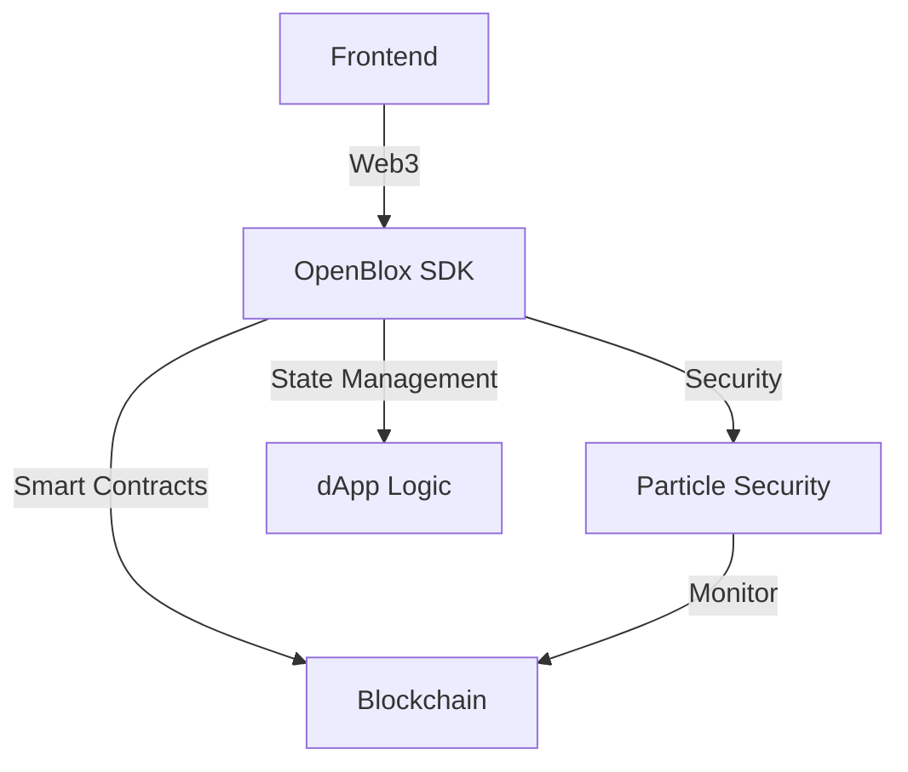

## Overview

This guide covers building secure and scalable decentralized applications (dApps) using OpenBlox's development framework and security features.



## Project Setup

### 1. Initialize dApp Project

```bash
# Create new dApp project
npx openblox create-dapp my-dapp
cd my-dapp

# Install dependencies
npm install @openblox/dapp-sdk @openblox/security @particle/defender-sdk
```

### 2. Basic Configuration

```typescript
// config/dapp.config.ts
import { DAppConfig } from '@openblox/dapp-sdk';

export const config: DAppConfig = {
  name: 'My DApp',
  version: '1.0.0',
  networks: ['ethereum', 'polygon'],
  security: {
    enabled: true,
    provider: 'particle'
  },
  storage: {
    type: 'ipfs',
    pinning: true
  }
};
```

## Smart Contract Integration

### 1. Contract Development

```solidity
// contracts/DAppLogic.sol
pragma solidity ^0.8.17;

import "@openblox/contracts/DAppBase.sol";
import "@openblox/security/Secured.sol";

contract DAppLogic is DAppBase, Secured {
    struct AppState {
        string data;
        uint256 timestamp;
        address owner;
    }
    
    mapping(bytes32 => AppState) private states;
    
    function setState(bytes32 key, string memory data) 
        external 
        secured 
    {
        states[key] = AppState(
            data,
            block.timestamp,
            msg.sender
        );
        
        emit StateUpdated(key, msg.sender);
    }
}
```

### 2. Frontend Integration

```typescript
// src/services/dapp.ts
import { OpenBloxDApp } from '@openblox/dapp-sdk';

class DAppService {
  private dapp: OpenBloxDApp;
  
  constructor() {
    this.dapp = new OpenBloxDApp({
      contracts: {
        logic: 'DAppLogic'
      },
      security: {
        monitoring: true,
        timelock: true
      }
    });
  }
  
  async updateState(key: string, data: string) {
    const tx = await this.dapp.contracts.logic.setState(key, data);
    await this.dapp.security.validateTransaction(tx);
    return tx;
  }
}
```

## State Management

### 1. Data Storage

```typescript
// src/storage/ipfs.ts
import { IPFSStorage } from '@openblox/storage';

const storage = new IPFSStorage({
  pinning: true,
  encryption: true
});

async function storeData(data: any) {
  const hash = await storage.store(data);
  return hash;
}
```

### 2. State Synchronization

```typescript
// src/state/sync.ts
import { StateSync } from '@openblox/dapp-sdk';

const sync = new StateSync({
  contract: 'DAppLogic',
  storage: 'ipfs',
  cache: {
    enabled: true,
    duration: 3600
  }
});

sync.on('stateChanged', async (key, newState) => {
  await updateUI(newState);
  await validateState(key, newState);
});
```

## Security Implementation

### 1. User Authentication

```typescript
// src/auth/index.ts
import { DAppAuth } from '@openblox/auth';

const auth = new DAppAuth({
  methods: ['wallet', 'email'],
  mfa: {
    required: true,
    methods: ['authenticator']
  }
});

async function authenticateUser() {
  const session = await auth.authenticate({
    requireMFA: true,
    sessionDuration: 3600
  });
  
  return session;
}
```

### 2. Transaction Security

```typescript
// src/security/transactions.ts
const securityConfig = {
  transactions: {
    validation: {
      required: true,
      timelock: 600 // 10 minutes
    },
    limits: {
      daily: '10 ETH',
      single: '2 ETH'
    }
  }
};

async function secureTransaction(tx: Transaction) {
  const validation = await openblox.security.validateTx(tx);
  
  if (validation.requiresTimelock) {
    await openblox.security.enforceTimelock(tx);
  }
  
  return validation.isValid;
}
```

## Testing

### 1. Unit Tests

```typescript
// tests/dapp.test.ts
describe('DApp Logic', () => {
  it('should update state securely', async () => {
    const key = 'test-key';
    const data = 'test-data';
    
    await dapp.setState(key, data);
    const state = await dapp.getState(key);
    
    expect(state.data).to.equal(data);
    expect(state.owner).to.equal(userAddress);
  });
});
```

### 2. Integration Tests

```typescript
describe('DApp Integration', () => {
  it('should handle state sync', async () => {
    const stateUpdate = {
      key: 'sync-test',
      data: 'sync-data'
    };
    
    await dapp.updateState(stateUpdate);
    await sync.waitForSync();
    
    const syncedState = await storage.get(stateUpdate.key);
    expect(syncedState).to.deep.equal(stateUpdate);
  });
});
```

## Best Practices

1. **Security**
   - Implement proper authentication
   - Validate all transactions
   - Use secure state management
   - Monitor contract interactions

2. **Performance**
   - Optimize contract calls
   - Implement caching
   - Use batch transactions
   - Minimize state updates

3. **User Experience**
   - Handle loading states
   - Provide clear error messages
   - Implement retry mechanisms
   - Support multiple networks

## Next Steps

1. Add advanced features
2. Implement complex state management
3. Enhance security measures
4. Deploy to production

For more information, see our [DApp Development Guide](../guides/dapp-development.md). 