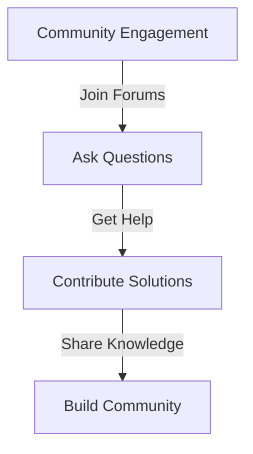

## Overview

This guide provides information on how to engage with the OpenBlox community and utilize developer forums for support and collaboration.



## Joining the Community

### 1. Online Forums

Participate in online forums dedicated to OpenBlox development.

- **OpenBlox Community Forum:** [Link to Forum](https://forum.openblox.org)
- **Stack Overflow:** Use the tag `openblox` to ask questions.

### 2. Social Media

Follow OpenBlox on social media platforms for updates and community interactions.

- **Twitter:** [@OpenBlox](https://twitter.com/OpenBlox)
- **Discord:** Join our Discord server for real-time discussions.

## Asking Questions

### 1. Be Clear and Concise

When asking questions, provide clear and concise information about your issue.

```markdown
**Title:** Error when deploying smart contract

**Description:**
I'm encountering an error when trying to deploy my smart contract. The error message is: "Out of gas." 

**Steps to Reproduce:**
1. Compile the contract.
2. Attempt to deploy on the testnet.

**Environment:**
- OpenBlox version: 1.0.0
- Network: Testnet
```

### 2. Search Before Posting

Before posting a question, search the forum to see if your issue has already been addressed.

## Contributing Solutions

### 1. Share Your Knowledge

If you have a solution to a common problem, consider sharing it in the forums.

### 2. Write Tutorials

Contribute by writing tutorials or guides to help others in the community.

## Best Practices

1. **Be Respectful and Supportive**
   - Treat all community members with respect and kindness.

2. **Stay On-Topic**
   - Keep discussions relevant to OpenBlox and its ecosystem.

3. **Follow Forum Guidelines**
   - Adhere to the rules and guidelines of the forums you participate in.

## Next Steps

1. Join the OpenBlox community forums.
2. Engage with other developers and share your experiences.
3. Contribute solutions and tutorials to help others.

For more information, see our [Community Guidelines](../guides/community-guidelines.md). 