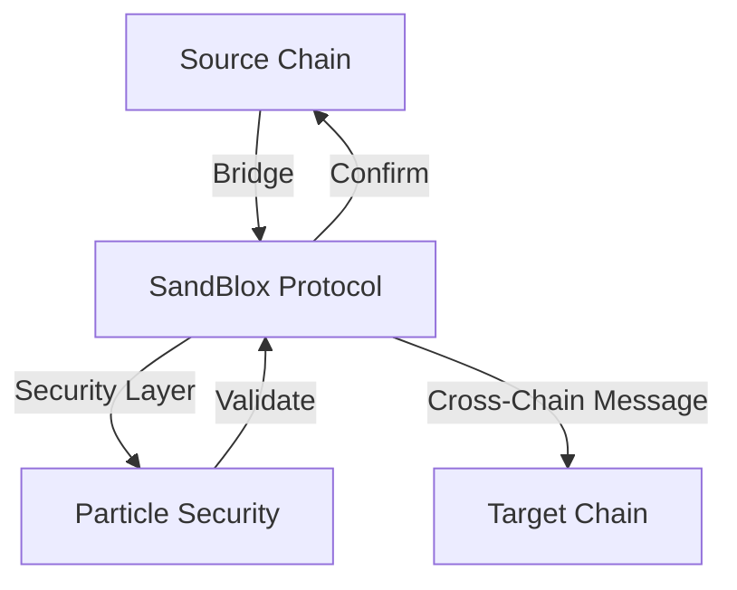

## Overview

This guide covers implementing secure cross-chain operations using SandBlox's interoperability features. Learn how to build applications that can seamlessly interact across multiple blockchain networks.



## Supported Networks

SandBlox supports cross-chain operations across major networks:

```typescript
const supportedNetworks = {
  ethereum: {
    mainnet: true,
    testnet: ['goerli', 'sepolia']
  },
  polygon: {
    mainnet: true,
    testnet: ['mumbai']
  },
  solana: {
    mainnet: true,
    testnet: ['devnet']
  },
  // Additional networks
  bsc: { mainnet: true },
  avalanche: { mainnet: true },
  fantom: { mainnet: true }
};
```

## Bridge Implementation

### 1. Basic Bridge Contract

```solidity
// contracts/CrossChainBridge.sol
pragma solidity ^0.8.17;

import "@sandblox/bridge/contracts/BridgeBase.sol";
import "@sandblox/security/CrossChainSecured.sol";

contract CrossChainBridge is BridgeBase, CrossChainSecured {
    event BridgeInitiated(bytes32 indexed messageId, address sender);
    event BridgeCompleted(bytes32 indexed messageId, bool success);
    
    function bridgeAssets(
        uint256 targetChainId,
        address recipient,
        uint256 amount
    ) external secured returns (bytes32) {
        bytes32 messageId = generateMessageId();
        
        // Lock assets on source chain
        _lockAssets(msg.sender, amount);
        
        // Initiate cross-chain transfer
        bytes memory message = abi.encode(recipient, amount);
        _sendCrossChainMessage(targetChainId, message);
        
        emit BridgeInitiated(messageId, msg.sender);
        return messageId;
    }
    
    function receiveBridgeMessage(
        bytes32 messageId,
        bytes memory message
    ) external onlyBridge {
        (address recipient, uint256 amount) = abi.decode(
            message,
            (address, uint256)
        );
        
        // Release assets on target chain
        _releaseAssets(recipient, amount);
        
        emit BridgeCompleted(messageId, true);
    }
}
```

### 2. Bridge Configuration

```typescript
// src/bridge/config.ts
import { SandBloxBridge } from '@sandblox/bridge';

const bridge = new SandBloxBridge({
  networks: {
    ethereum: {
      rpc: process.env.ETH_RPC_URL,
      bridge: '0x...',
      validators: ['0x...', '0x...']
    },
    polygon: {
      rpc: process.env.POLYGON_RPC_URL,
      bridge: '0x...',
      validators: ['0x...', '0x...']
    }
  },
  security: {
    timelock: true,
    validation: true,
    monitoring: true
  }
});
```

## Cross-Chain Messaging

### 1. Message Protocol

```typescript
interface CrossChainMessage {
  id: string;
  sourceChain: number;
  targetChain: number;
  sender: string;
  recipient: string;
  payload: string;
  status: 'pending' | 'processing' | 'completed' | 'failed';
}

// Send cross-chain message
async function sendMessage(message: CrossChainMessage) {
  const tx = await bridge.sendMessage(message);
  await bridge.security.validateMessage(message);
  return tx;
}
```

### 2. Message Validation

```typescript
// src/validation/cross-chain.ts
const validationConfig = {
  messages: {
    maxSize: 1024, // bytes
    timeout: 3600, // seconds
    requiredConfirmations: 12
  },
  security: {
    validators: 3,
    threshold: 2
  }
};

async function validateCrossChainMessage(message: CrossChainMessage) {
  // Validate message format and size
  if (!isValidMessageFormat(message)) {
    throw new Error('Invalid message format');
  }
  
  // Check security parameters
  const securityCheck = await bridge.security.checkMessage(message);
  if (!securityCheck.valid) {
    throw new Error(securityCheck.reason);
  }
  
  return true;
}
```

## Asset Transfer

### 1. Token Bridge

```typescript
// src/bridge/tokens.ts
async function bridgeTokens(params: {
  sourceChain: number;
  targetChain: number;
  token: string;
  amount: string;
  recipient: string;
}) {
  // Validate parameters
  await bridge.validateTransfer(params);
  
  // Lock tokens on source chain
  const lockTx = await bridge.lockTokens(params);
  await lockTx.wait(params.sourceChain.confirmations);
  
  // Initiate cross-chain transfer
  const bridgeTx = await bridge.initiateTransfer(params);
  
  // Monitor transfer status
  bridge.on('transfer', async (status) => {
    if (status.completed) {
      await notifyCompletion(status);
    }
  });
  
  return bridgeTx;
}
```

### 2. Security Measures

```typescript
const securityConfig = {
  transfers: {
    maxAmount: '100000 USD',
    dailyLimit: '1000000 USD',
    timelock: {
      small: 0,
      medium: 600,  // 10 minutes
      large: 3600   // 1 hour
    }
  }
};

async function enforceSecurityMeasures(transfer: Transfer) {
  // Check transfer limits
  if (transfer.amount > securityConfig.transfers.maxAmount) {
    throw new Error('Exceeds maximum transfer amount');
  }
  
  // Apply timelock based on amount
  const timelock = calculateTimelock(transfer.amount);
  if (timelock > 0) {
    await bridge.security.applyTimelock(transfer, timelock);
  }
}
```

## Error Handling

```typescript
class CrossChainError extends Error {
  constructor(
    message: string,
    public chainId: number,
    public code: string
  ) {
    super(message);
    this.name = 'CrossChainError';
  }
}

async function handleCrossChainError(error: CrossChainError) {
  switch (error.code) {
    case 'BRIDGE_UNAVAILABLE':
      await notifyBridgeFailure(error);
      break;
    case 'VALIDATION_FAILED':
      await revertTransfer(error);
      break;
    case 'TIMEOUT':
      await retryTransfer(error);
      break;
  }
}
```

## Best Practices

1. **Security**
   - Validate all cross-chain messages
   - Implement proper timelock mechanisms
   - Monitor bridge operations
   - Handle failed transfers gracefully

2. **Reliability**
   - Implement retry mechanisms
   - Use multiple validators
   - Monitor network status
   - Handle network congestion

3. **User Experience**
   - Provide transfer status updates
   - Clear error messages
   - Estimated completion times
   - Transaction history

## Next Steps

1. Implement advanced bridging features
2. Add support for more networks
3. Enhance security measures
4. Optimize gas usage

For more information, see our [Cross-Chain Integration Guide](../guides/cross-chain.md). 