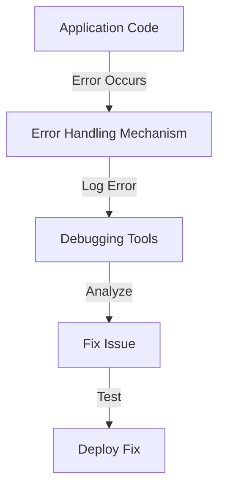

## Overview

This guide provides strategies and best practices for debugging and handling errors in SandBlox applications, ensuring a smooth development experience.



## Debugging Techniques

### 1. Logging

Implement logging to capture important events and errors in your application.

```typescript
// src/utils/logger.ts
import { createLogger, format, transports } from 'winston';

const logger = createLogger({
  level: 'info',
  format: format.combine(
    format.timestamp(),
    format.json()
  ),
  transports: [
    new transports.Console(),
    new transports.File({ filename: 'error.log', level: 'error' })
  ]
});

export default logger;
```

### 2. Error Handling

Use try-catch blocks to handle errors gracefully and provide meaningful feedback.

```typescript
async function fetchData() {
  try {
    const response = await api.get('/data');
    return response.data;
  } catch (error) {
    logger.error('Error fetching data:', error);
    throw new Error('Failed to fetch data');
  }
}
```

## Common Errors and Solutions

### 1. Network Errors

**Issue:** Unable to connect to the API.

**Solution:** Check your network connection and ensure the API endpoint is correct.

### 2. Validation Errors

**Issue:** Input data does not meet validation criteria.

**Solution:** Ensure all required fields are filled and data types are correct.

### 3. Contract Errors

**Issue:** Smart contract execution fails.

**Solution:** Review the contract logic and ensure all conditions are met.

## Best Practices

1. **Use Descriptive Error Messages**
   - Provide clear and actionable error messages to users.

2. **Implement Centralized Error Handling**
   - Use a centralized error handling mechanism to manage errors consistently.

3. **Regularly Review Logs**
   - Monitor logs for recurring issues and address them proactively.

## Next Steps

1. Implement logging and error handling in your application.
2. Review common errors and their solutions.
3. Test your application thoroughly before deployment.

For more information, see our [Error Handling Guide](../guides/error-handling.md). 