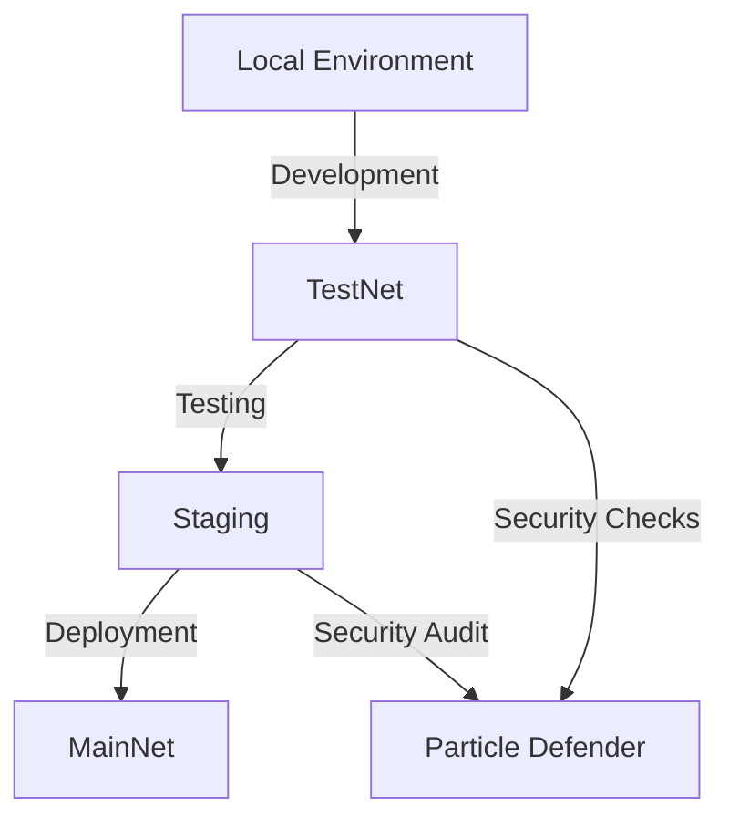

## Development Environment Setup

### Overview

SandBlox development follows a structured workflow from local development through to production deployment. This guide will help you set up a secure and efficient development environment.



## Environment Configuration

### 1. Local Development Setup

Create an environment configuration file:

```typescript
// config/environment.ts
export const config = {
  development: {
    network: 'localhost',
    port: 8545,
    security: {
      level: 'basic',
      monitoring: true
    }
  },
  testnet: {
    network: 'goerli',
    security: {
      level: 'enhanced',
      monitoring: true,
      timelock: true
    }
  },
  production: {
    network: 'mainnet',
    security: {
      level: 'maximum',
      monitoring: true,
      timelock: true,
      mfa: true
    }
  }
};
```

### 2. Security Integration

Set up Particle Defender for security monitoring:

```typescript
import { ParticleDefender } from '@particle/defender-sdk';

const defender = new ParticleDefender({
  apiKey: process.env.PARTICLE_API_KEY,
  environment: process.env.NODE_ENV,
  monitoring: {
    enabled: true,
    interval: 60,
    alertChannels: ['slack', 'email']
  }
});

await defender.initialize();
```

## Development Tools Setup

### 1. IDE Configuration

Recommended Visual Studio Code settings:

```json
{
  "solidity.packageDefaultDependenciesContractsDirectory": "src/contracts",
  "solidity.packageDefaultDependenciesDirectory": "node_modules",
  "solidity.compileUsingRemoteVersion": "v0.8.17",
  "sandblox.autoComplete": true,
  "sandblox.security.enabled": true
}
```

### 2. Testing Environment

Set up a local blockchain for testing:

```bash
# Start local blockchain
sandblox network start

# Deploy test contracts
sandblox deploy --network local
```

Configure test environment:

```typescript
// test/config.ts
export const testConfig = {
  networks: ['local', 'testnet'],
  security: {
    timelock: 60, // 1 minute for testing
    monitoring: true
  },
  logging: 'debug'
};
```

## Monitoring Setup

### Development Monitoring

```typescript
const monitor = sandblox.createMonitor({
  level: 'development',
  metrics: {
    gas: true,
    calls: true,
    errors: true
  },
  alerts: {
    channels: ['console', 'file'],
    thresholds: {
      gas: 5000000,
      errors: 1
    }
  }
});

// Start monitoring
await monitor.start();
```

## Security Best Practices

### Development Guidelines

1. **Version Control**
   - Use `.gitignore` for sensitive files
   - Never commit private keys or API keys
   - Use environment variables for secrets

2. **Smart Contract Development**
   - Enable compiler optimization
   - Use latest Solidity version
   - Implement security patterns

Example `.gitignore`:
```
.env
.env.*
node_modules/
coverage/
artifacts/
cache/
private/
```

## Deployment Configuration

Create a deployment configuration file:

```typescript
// config/deployment.ts
export const deployConfig = {
  networks: {
    local: {
      url: 'http://localhost:8545',
      chainId: 31337
    },
    testnet: {
      url: process.env.TESTNET_RPC_URL,
      chainId: 5,
      accounts: {
        mnemonic: process.env.TESTNET_MNEMONIC
      }
    }
  },
  security: {
    defender: {
      apiKey: process.env.DEFENDER_API_KEY,
      apiSecret: process.env.DEFENDER_API_SECRET
    }
  }
};
```

## Next Steps

1. Set up your first smart contract project
2. Configure testing environment
3. Implement security monitoring
4. Deploy to testnet

For more information on security features, see our [Security Guide](../security/overview.md). 