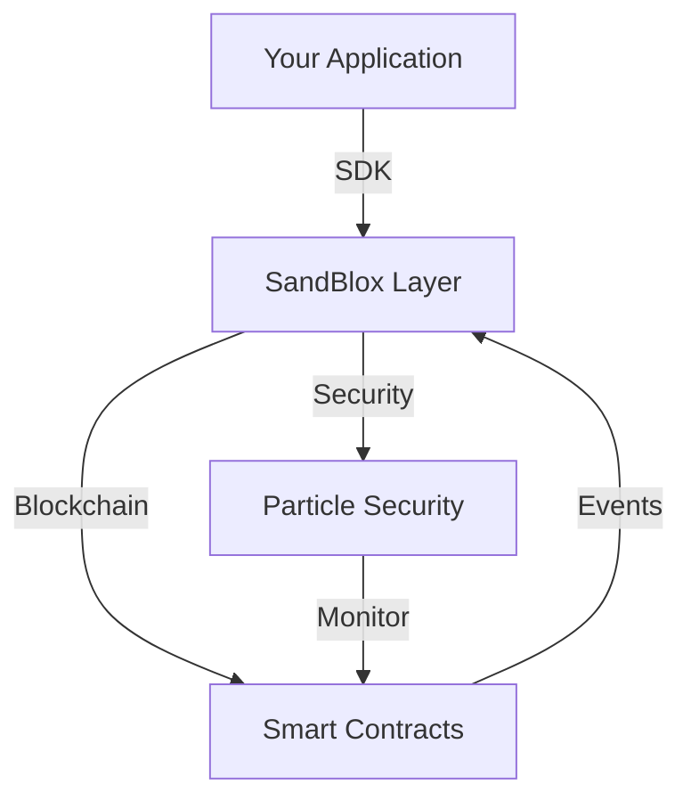

## Overview

This guide walks you through creating your first blockchain integration using SandBlox. We'll create a simple smart contract and integrate it with security features.



## Creating Your First Smart Contract

### 1. Basic Smart Contract

Create a new file `contracts/SimpleStorage.sol`:

```solidity
// SPDX-License-Identifier: MIT
pragma solidity ^0.8.17;

import "@sandblox/security/contracts/SandBloxSecured.sol";

contract SimpleStorage is SandBloxSecured {
    uint256 private value;
    event ValueChanged(uint256 oldValue, uint256 newValue);
    
    function setValue(uint256 newValue) public secured {
        uint256 oldValue = value;
        value = newValue;
        emit ValueChanged(oldValue, newValue);
    }
    
    function getValue() public view returns (uint256) {
        return value;
    }
}
```

### 2. Contract Deployment

Create a deployment script `scripts/deploy.ts`:

```typescript
import { SandBlox } from '@sandblox/sdk';

async function main() {
  const sandblox = new SandBlox({
    apiKey: process.env.SANDBLOX_API_KEY,
    network: 'testnet'
  });

  // Deploy with security features
  const contract = await sandblox.deploy('SimpleStorage', {
    security: {
      timelock: true,
      monitoring: true
    }
  });

  console.log('Contract deployed to:', contract.address);
  
  // Verify contract on explorer
  await sandblox.verify(contract.address, {
    contract: 'SimpleStorage'
  });
}

main()
  .then(() => process.exit(0))
  .catch(error => {
    console.error(error);
    process.exit(1);
  });
```

## Integrating Security Features

### 1. Configure Security Settings

```typescript
// Configure security for your contract
const security = await sandblox.security.configure({
  contract: contract.address,
  features: {
    mfa: {
      required: true,
      methods: ['email', 'authenticator']
    },
    monitoring: {
      enabled: true,
      alertThresholds: {
        suspicious: 0.7,
        critical: 0.9
      }
    },
    timelock: {
      duration: 24 * 60 * 60, // 24 hours
      cancelable: true
    }
  }
});
```

### 2. Implement Event Monitoring

```typescript
// Monitor contract events
contract.on('ValueChanged', async (oldValue, newValue) => {
  console.log(`Value changed from ${oldValue} to ${newValue}`);
  
  // Validate change through security layer
  const validationResult = await sandblox.security.validateChange({
    type: 'value',
    old: oldValue,
    new: newValue,
    contract: contract.address
  });

  if (!validationResult.valid) {
    console.error('Security validation failed:', validationResult.reason);
  }
});
```

## Interacting with Your Contract

### 1. Basic Interactions

```typescript
// Read contract value
const currentValue = await contract.getValue();
console.log('Current value:', currentValue);

// Update value with security
try {
  const tx = await contract.setValue(42);
  
  // Wait for security confirmations
  await sandblox.security.waitForConfirmation(tx.hash);
  
  console.log('Value updated successfully');
} catch (error) {
  console.error('Transaction failed:', error.message);
}
```

### 2. Error Handling

```typescript
try {
  await contract.setValue(100);
} catch (error) {
  switch (error.code) {
    case 'SECURITY_ERROR':
      console.error('Security check failed:', error.message);
      break;
    case 'CONTRACT_ERROR':
      console.error('Contract error:', error.message);
      break;
    default:
      console.error('Unknown error:', error);
  }
}
```

## Testing Your Integration

### 1. Create Test Cases

```typescript
import { expect } from 'chai';

describe('SimpleStorage', () => {
  it('should set value with security', async () => {
    const newValue = 42;
    await contract.setValue(newValue);
    
    // Wait for timelock if enabled
    await sandblox.security.waitForTimelock(contract.address);
    
    const value = await contract.getValue();
    expect(value).to.equal(newValue);
  });
});
```

## Best Practices

1. **Security First**
   - Always enable security features
   - Implement proper error handling
   - Monitor contract events
   - Use timelocks for sensitive operations

2. **Testing**
   - Test on local network first
   - Use testnet before mainnet
   - Test security features thoroughly
   - Validate all error cases

3. **Monitoring**
   - Set up alerts for suspicious activity
   - Monitor gas usage
   - Track contract interactions
   - Log security events

## Next Steps

1. Explore advanced security features
2. Implement custom security rules
3. Add more complex contract interactions
4. Deploy to mainnet

For more examples and advanced features, check our [Integration Examples](../examples/integration-examples.md). 