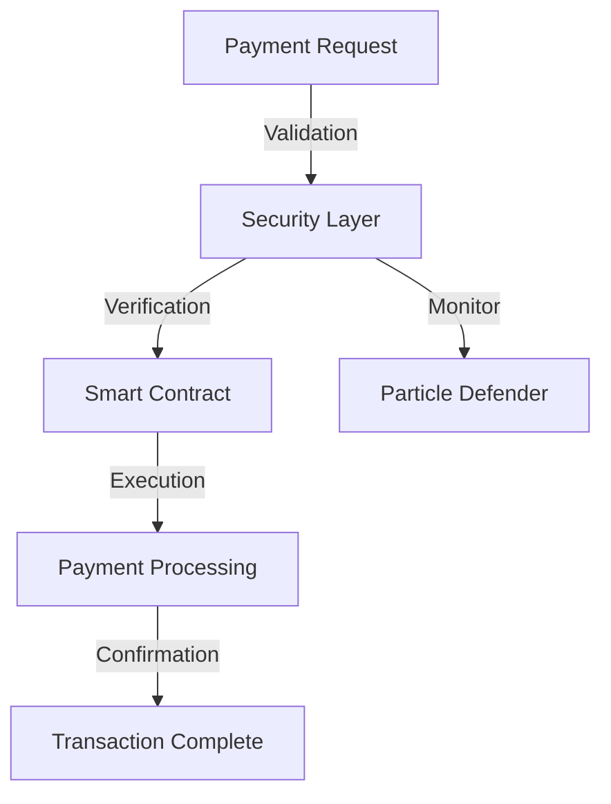

## Overview

This guide covers implementing secure blockchain payment systems using SandBlox's payment infrastructure and Particle's security features.



## Payment Implementation

### 1. Basic Payment Contract

```solidity
// SPDX-License-Identifier: MIT
pragma solidity ^0.8.17;

import "@sandblox/security/contracts/SandBloxSecured.sol";
import "@sandblox/payments/contracts/IPaymentProcessor.sol";

contract SecurePayment is SandBloxSecured, IPaymentProcessor {
    mapping(address => uint256) private balances;
    
    event PaymentProcessed(address from, address to, uint256 amount);
    
    function processPayment(
        address recipient,
        uint256 amount
    ) external secured returns (bool) {
        require(balances[msg.sender] >= amount, "Insufficient balance");
        
        balances[msg.sender] -= amount;
        balances[recipient] += amount;
        
        emit PaymentProcessed(msg.sender, recipient, amount);
        return true;
    }
}
```

### 2. Payment Integration

```typescript
import { SandBlox } from '@sandblox/sdk';
import { PaymentProcessor } from '@sandblox/payments';

// Initialize payment processor
const payments = new PaymentProcessor({
  contract: 'SecurePayment',
  security: {
    timelock: 60 * 60, // 1 hour for large payments
    verification: true,
    monitoring: true
  }
});

// Process payment
async function sendPayment(recipient: string, amount: string) {
  try {
    const tx = await payments.send({
      to: recipient,
      amount: amount,
      currency: 'ETH',
      security: {
        requireConfirmation: true,
        maxGas: '50000'
      }
    });

    await tx.wait(2); // Wait for confirmations
    return tx.hash;
  } catch (error) {
    console.error('Payment failed:', error);
    throw error;
  }
}
```

## Security Features

### 1. Payment Validation

```typescript
const securityConfig = {
  payments: {
    limits: {
      daily: '10 ETH',
      single: '2 ETH'
    },
    verification: {
      required: ['2FA', 'email'],
      threshold: '1 ETH'
    }
  }
};

// Implement payment validation
async function validatePayment(payment) {
  const validation = await sandblox.security.validatePayment({
    amount: payment.amount,
    recipient: payment.to,
    type: payment.type
  });

  return validation.isValid;
}
```

### 2. Transaction Monitoring

```typescript
// Setup payment monitoring
const monitor = sandblox.payments.createMonitor({
  alertThresholds: {
    amount: '5 ETH',
    frequency: 10 // transactions per hour
  },
  notifications: ['email', 'slack']
});

monitor.on('suspicious', async (tx) => {
  await sandblox.security.freezePayments(tx.sender);
  await notifyAdmins(tx);
});
```

## Error Handling

```typescript
class PaymentError extends Error {
  constructor(
    message: string,
    public code: string,
    public transaction?: string
  ) {
    super(message);
    this.name = 'PaymentError';
  }
}

async function handlePaymentError(error: PaymentError) {
  switch (error.code) {
    case 'INSUFFICIENT_FUNDS':
      await notifyUserBalance(error);
      break;
    case 'SECURITY_THRESHOLD':
      await requestAdditionalVerification(error);
      break;
    case 'RATE_LIMIT':
      await handleRateLimit(error);
      break;
    default:
      await logError(error);
  }
}
```

## Best Practices

### Security Considerations

1. **Transaction Verification**
   - Implement multi-factor authentication
   - Use timelocks for large transactions
   - Verify recipient addresses
   - Monitor transaction patterns

2. **Rate Limiting**
   - Set daily transaction limits
   - Implement cooling periods
   - Monitor frequency of transactions
   - Set gas price limits

3. **Error Recovery**
   - Implement transaction rollback
   - Maintain transaction logs
   - Provide user notifications
   - Handle network issues

## Testing

```typescript
describe('Payment System', () => {
  it('should process secure payments', async () => {
    const payment = {
      to: '0x...',
      amount: '1 ETH',
      type: 'transfer'
    };

    const result = await payments.process(payment);
    expect(result.status).to.equal('success');
    expect(result.confirmations).to.be.gt(0);
  });

  it('should enforce security limits', async () => {
    const largePayment = {
      to: '0x...',
      amount: '100 ETH',
      type: 'transfer'
    };

    await expect(
      payments.process(largePayment)
    ).to.be.revertedWith('Exceeds daily limit');
  });
});
```

## Next Steps

1. Implement advanced payment features
2. Add support for multiple tokens
3. Enhance security measures
4. Set up automated monitoring

For more information, see our [Payment API Reference](../api/payment-api.md). 