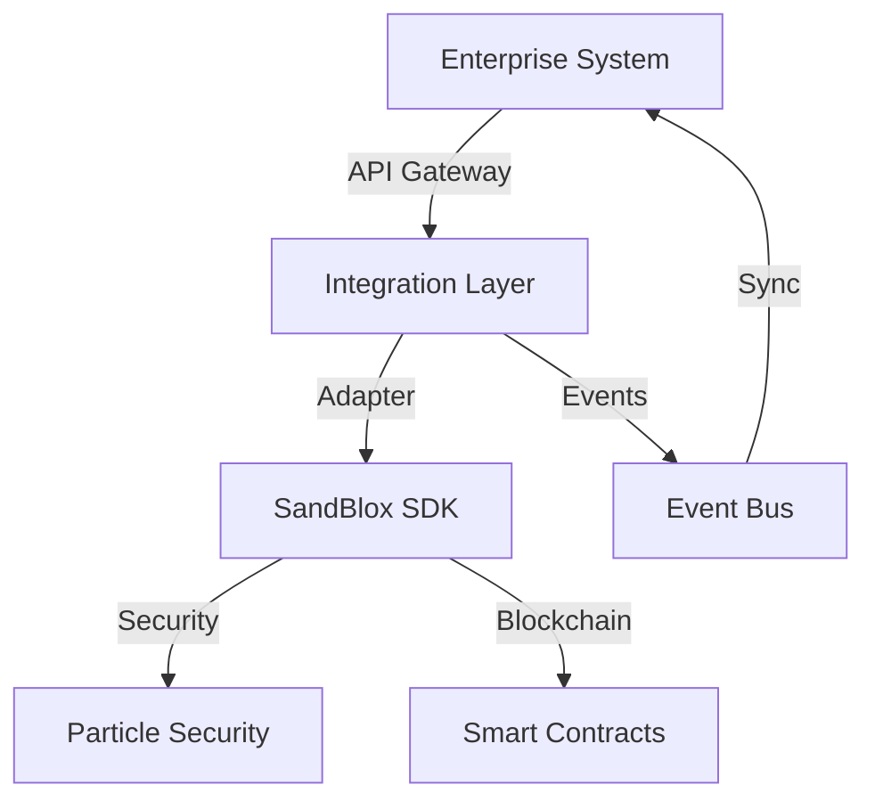

## Overview

This guide covers strategies and best practices for integrating SandBlox with existing enterprise systems, ensuring seamless operation with legacy infrastructure.



## Integration Architecture

### 1. Integration Layer Setup

```typescript
// config/integration.config.ts
import { IntegrationConfig } from '@sandblox/enterprise';

export const config: IntegrationConfig = {
  adapters: {
    erp: {
      type: 'sap',
      endpoint: process.env.ERP_ENDPOINT,
      auth: {
        type: 'oauth2',
        credentials: {
          clientId: process.env.ERP_CLIENT_ID,
          clientSecret: process.env.ERP_CLIENT_SECRET
        }
      }
    },
    crm: {
      type: 'salesforce',
      endpoint: process.env.CRM_ENDPOINT,
      webhooks: {
        enabled: true,
        events: ['account.update', 'contract.create']
      }
    }
  },
  sync: {
    interval: 300, // 5 minutes
    retries: 3,
    timeout: 30000
  }
};
```

## Data Integration

### 1. Data Mapping Contract

```solidity
// contracts/DataMapping.sol
pragma solidity ^0.8.17;

import "@sandblox/enterprise/contracts/DataAdapter.sol";
import "@sandblox/security/EnterpriseSecured.sol";

contract DataMapping is DataAdapter, EnterpriseSecured {
    struct ExternalSystemRef {
        string systemId;
        string entityType;
        string externalId;
        uint256 lastSync;
    }
    
    mapping(bytes32 => ExternalSystemRef) private systemRefs;
    
    event DataMapped(bytes32 indexed mappingId, string systemId, string externalId);
    
    function mapExternalEntity(
        string memory systemId,
        string memory entityType,
        string memory externalId
    ) external secured returns (bytes32) {
        bytes32 mappingId = keccak256(
            abi.encodePacked(systemId, entityType, externalId)
        );
        
        systemRefs[mappingId] = ExternalSystemRef({
            systemId: systemId,
            entityType: entityType,
            externalId: externalId,
            lastSync: block.timestamp
        });
        
        emit DataMapped(mappingId, systemId, externalId);
        return mappingId;
    }
}
```

### 2. Integration Service

```typescript
class EnterpriseIntegrationService {
  constructor(
    private sandblox: SandBlox,
    private config: IntegrationConfig
  ) {}

  async syncExternalSystem(systemId: string): Promise<void> {
    const adapter = await this.getSystemAdapter(systemId);
    const entities = await adapter.fetchUpdatedEntities();

    for (const entity of entities) {
      await this.processEntitySync(entity);
    }
  }

  private async processEntitySync(entity: ExternalEntity): Promise<void> {
    try {
      const mappingId = await this.dataMapping.mapExternalEntity(
        entity.systemId,
        entity.type,
        entity.id
      );

      await this.eventBus.emit('entity.synced', {
        mappingId,
        entity,
        timestamp: Date.now()
      });
    } catch (error) {
      await this.handleSyncError(error, entity);
    }
  }
}
```

## Security Considerations

### 1. Access Control

```typescript
const securityConfig = {
  integration: {
    accessControl: {
      roles: ['SYSTEM_INTEGRATOR', 'ADMIN'],
      permissions: {
        'data.sync': ['SYSTEM_INTEGRATOR'],
        'mapping.create': ['ADMIN'],
        'config.update': ['ADMIN']
      }
    },
    audit: {
      enabled: true,
      events: ['sync', 'mapping', 'error']
    }
  }
};
```

### 2. Data Validation

```typescript
class DataValidator {
  validate(data: any, schema: ValidationSchema): ValidationResult {
    // Implement validation logic
    const validation = this.validateAgainstSchema(data, schema);
    
    if (!validation.isValid) {
      throw new ValidationError(validation.errors);
    }
    
    return validation;
  }
}
```

## Best Practices

1. **System Integration**
   - Use appropriate adapters
   - Implement proper error handling
   - Maintain data consistency
   - Monitor integration health

2. **Performance**
   - Optimize sync intervals
   - Implement caching
   - Use batch processing
   - Monitor resource usage

3. **Security**
   - Validate all data transfers
   - Implement access controls
   - Audit system activities
   - Secure API endpoints

## Next Steps

1. Configure system adapters
2. Set up data mapping
3. Implement sync processes
4. Monitor integration performance

For more information, see our [Enterprise Integration Guide](../guides/enterprise-integration.md). 