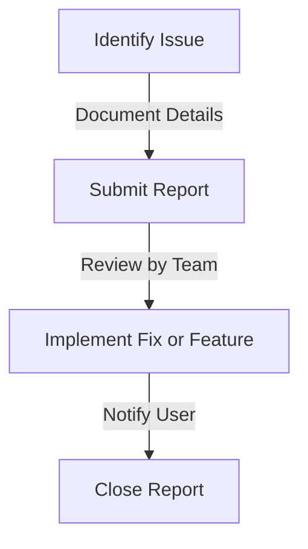

## Overview

This guide outlines the process for reporting issues and requesting new features for SandBlox, ensuring that your feedback is heard and addressed.



## Reporting Issues

### 1. Gather Information

Before reporting an issue, gather all relevant information to help the team understand the problem.

- **Description:** Clearly describe the issue.
- **Steps to Reproduce:** List the steps to reproduce the issue.
- **Environment:** Specify the version of SandBlox and the environment (e.g., testnet, mainnet).

### 2. Submit an Issue

Submit your issue through the official issue tracker.

- **GitHub Issues:** [SandBlox GitHub](https://github.com/sandblox/sandblox/issues)

### 3. Follow Up

After submitting, monitor the issue for any updates or requests for additional information.

## Requesting Features

### 1. Describe the Feature

When requesting a new feature, provide a clear description of what you would like to see.

```markdown
**Feature Request:** Add support for additional blockchain networks.

**Description:**
It would be beneficial to support additional networks such as Avalanche and Fantom for broader integration options.
```

### 2. Submit Your Request

Feature requests can also be submitted through the issue tracker.

- **GitHub Feature Requests:** [SandBlox GitHub](https://github.com/sandblox/sandblox/issues)

## Best Practices

1. **Be Specific**
   - Provide as much detail as possible to help the team understand your issue or request.

2. **Be Patient**
   - Understand that the team may take time to review and respond to your submissions.

3. **Engage with the Community**
   - Discuss your issues or feature requests with other community members for additional insights.

## Next Steps

1. Report any issues you encounter with SandBlox.
2. Submit feature requests for enhancements you would like to see.
3. Engage with the community for support and collaboration.

For more information, see our [Feedback and Support Guide](../guides/feedback-support.md). 