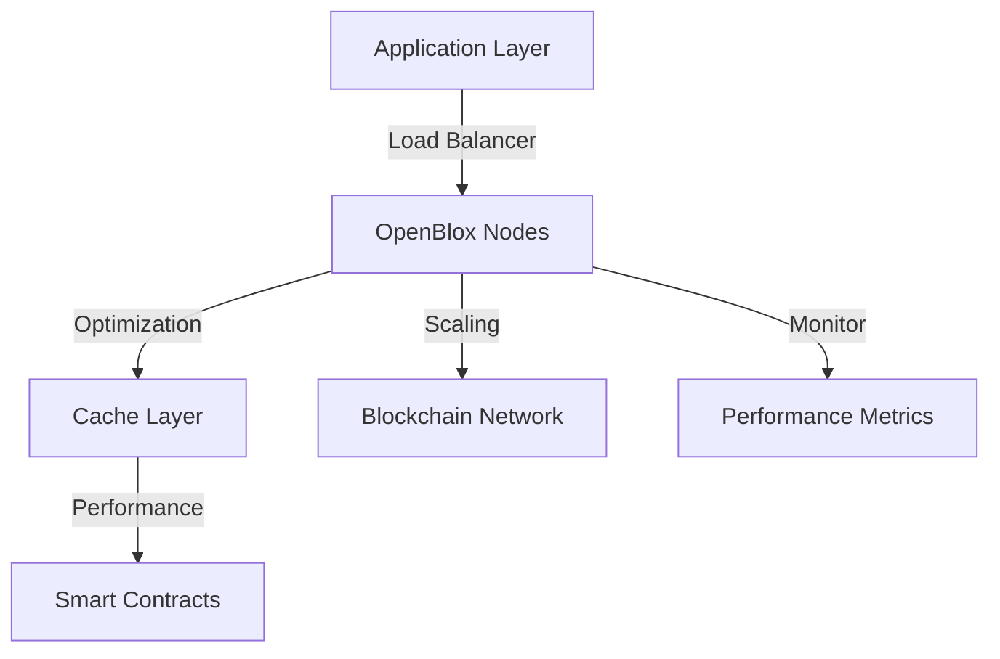

## Overview

This guide covers strategies and techniques for optimizing performance and scaling OpenBlox implementations in enterprise environments.



## Performance Optimization

### 1. Smart Contract Optimization

```solidity
// contracts/OptimizedContract.sol
pragma solidity ^0.8.17;

import "@openblox/optimization/StorageOptimized.sol";
import "@openblox/security/SecureContract.sol";

contract OptimizedContract is StorageOptimized, SecureContract {
    // Use packed storage for gas optimization
    struct PackedData {
        uint128 value1;
        uint128 value2;
    }
    
    // Use mapping instead of array for O(1) access
    mapping(bytes32 => PackedData) private dataStore;
    
    // Batch processing for multiple operations
    function batchProcess(
        bytes32[] calldata keys,
        uint128[] calldata values
    ) external secured {
        require(keys.length == values.length, "Length mismatch");
        
        for (uint i = 0; i < keys.length; i++) {
            PackedData storage data = dataStore[keys[i]];
            data.value1 = values[i];
            data.value2 = block.timestamp;
        }
        
        emit BatchProcessed(keys.length);
    }
}
```

### 2. Caching Implementation

```typescript
// src/cache/strategy.ts
import { CacheManager } from '@openblox/cache';

const cacheConfig = {
  layers: {
    memory: {
      type: 'memory',
      maxSize: '1GB',
      ttl: 300 // 5 minutes
    },
    redis: {
      type: 'redis',
      url: process.env.REDIS_URL,
      maxSize: '10GB',
      ttl: 3600 // 1 hour
    }
  },
  strategies: {
    contract: {
      type: 'tiered',
      layers: ['memory', 'redis']
    },
    state: {
      type: 'distributed',
      consistency: 'strong'
    }
  }
};

class PerformanceOptimizer {
  private cache: CacheManager;

  constructor() {
    this.cache = new CacheManager(cacheConfig);
  }

  async optimizeContractCall(
    contractAddress: string,
    method: string,
    params: any[]
  ): Promise<any> {
    const cacheKey = this.generateCacheKey(contractAddress, method, params);
    
    // Try cache first
    const cached = await this.cache.get(cacheKey);
    if (cached) return cached;
    
    // Execute contract call
    const result = await this.executeContractCall(
      contractAddress,
      method,
      params
    );
    
    // Cache result
    await this.cache.set(cacheKey, result);
    return result;
  }
}
```

## Scaling Strategies

### 1. Node Scaling

```typescript
// src/scaling/node-manager.ts
interface NodeConfig {
  maxConnections: number;
  scaling: {
    min: number;
    max: number;
    threshold: number;
  };
  loadBalancing: {
    strategy: 'round-robin' | 'least-connections';
    healthCheck: {
      interval: number;
      timeout: number;
    }
  };
}

class NodeManager {
  async scaleNodes(metrics: PerformanceMetrics): Promise<void> {
    const currentLoad = metrics.getAverageLoad();
    
    if (currentLoad > this.config.scaling.threshold) {
      await this.addNode();
    } else if (this.canReduceNodes()) {
      await this.removeNode();
    }
  }
}
```

### 2. Transaction Batching

```typescript
// src/optimization/batch-processor.ts
class TransactionBatchProcessor {
  private queue: Transaction[] = [];
  private readonly maxBatchSize = 100;
  private readonly maxWaitTime = 5000; // 5 seconds

  async addToQueue(tx: Transaction): Promise<void> {
    this.queue.push(tx);
    
    if (this.shouldProcessBatch()) {
      await this.processBatch();
    }
  }

  private async processBatch(): Promise<void> {
    const batch = this.queue.splice(0, this.maxBatchSize);
    
    try {
      await this.openblox.submitBatch(batch, {
        optimization: {
          gasPrice: 'optimal',
          nonce: 'batch'
        }
      });
    } catch (error) {
      await this.handleBatchError(error, batch);
    }
  }
}
```

## Performance Monitoring

### 1. Metrics Collection

```typescript
const monitoringConfig = {
  metrics: {
    collection: {
      interval: 60, // seconds
      retention: '30d'
    },
    thresholds: {
      cpu: 80, // percentage
      memory: 85,
      latency: 1000 // ms
    }
  },
  alerts: {
    channels: ['slack', 'email'],
    rules: {
      highLoad: {
        condition: 'cpu > 80% || memory > 85%',
        severity: 'warning'
      },
      critical: {
        condition: 'latency > 2000 || error_rate > 5%',
        severity: 'critical'
      }
    }
  }
};
```

### 2. Performance Analysis

```typescript
class PerformanceAnalyzer {
  async analyzePerformance(): Promise<PerformanceReport> {
    const metrics = await this.collectMetrics();
    
    return {
      throughput: this.calculateThroughput(metrics),
      latency: this.analyzeLatency(metrics),
      resourceUsage: this.analyzeResources(metrics),
      recommendations: this.generateRecommendations(metrics)
    };
  }
}
```

## Best Practices

1. **Contract Optimization**
   - Use efficient data structures
   - Implement batch processing
   - Optimize storage usage
   - Minimize on-chain operations

2. **Caching Strategy**
   - Implement multi-layer caching
   - Use appropriate TTL values
   - Cache invalidation strategy
   - Monitor cache hit rates

3. **Scaling Approach**
   - Horizontal scaling
   - Load balancing
   - Resource monitoring
   - Automated scaling

## Next Steps

1. Implement optimization strategies
2. Set up performance monitoring
3. Configure scaling parameters
4. Regular performance audits

For more information, see our [Performance Optimization Guide](../guides/performance.md). 