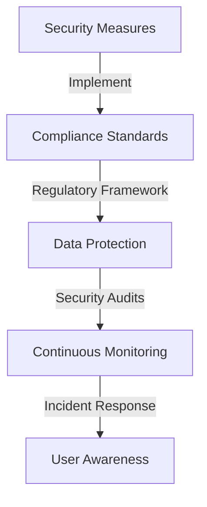

## Overview

This guide outlines the essential security measures and compliance standards that OpenBlox implementations should adhere to, ensuring robust protection against threats and regulatory compliance.



## Security Measures

### 1. Access Control

Implement strict access control measures to ensure that only authorized personnel can access sensitive data and systems.

```typescript
const accessControlConfig = {
  roles: ['ADMIN', 'USER', 'AUDITOR'],
  permissions: {
    'data.access': ['ADMIN', 'USER'],
    'data.modify': ['ADMIN'],
    'audit.view': ['AUDITOR']
  }
};
```

### 2. Data Encryption

Ensure that all sensitive data is encrypted both at rest and in transit to protect against unauthorized access.

```solidity
// contracts/DataEncryption.sol
pragma solidity ^0.8.17;

contract DataEncryption {
    function encryptData(bytes memory data) public pure returns (bytes memory) {
        // Implement encryption logic
        return data; // Placeholder for actual encryption
    }
}
```

### 3. Multi-Factor Authentication (MFA)

Implement MFA for all user accounts to enhance security and reduce the risk of unauthorized access.

```typescript
// Configure MFA settings
const mfaConfig = {
  enabled: true,
  methods: ['sms', 'email', 'authenticator_app']
};
```

### 4. Regular Security Audits

Conduct regular security audits to identify vulnerabilities and ensure compliance with security policies.

```typescript
// Audit schedule
const auditSchedule = {
  frequency: 'quarterly',
  lastAudit: '2024-01-15',
  nextAudit: '2024-04-15'
};
```

## Compliance Standards

### 1. Regulatory Compliance

Ensure compliance with relevant regulations such as GDPR, CCPA, and industry-specific standards.

```typescript
const complianceConfig = {
  regulations: {
    gdpr: true,
    ccpa: true,
    pciDSS: true
  },
  reporting: {
    frequency: 'monthly',
    responsible: 'compliance@openblox.org'
  }
};
```

### 2. Data Protection Policies

Implement data protection policies that outline how data is collected, processed, and stored.

```typescript
const dataProtectionPolicy = {
  dataMinimization: true,
  userConsent: true,
  dataRetention: {
    period: '12 months',
    secureDeletion: true
  }
};
```

### 3. Incident Response Plan

Develop and maintain an incident response plan to address security breaches and data leaks promptly.

```typescript
const incidentResponsePlan = {
  steps: [
    'Identify the incident',
    'Contain the breach',
    'Eradicate the threat',
    'Recover systems',
    'Notify affected parties'
  ],
  responsibleTeam: 'security@openblox.org'
};
```

## Best Practices

1. **Continuous Monitoring**
   - Implement real-time monitoring of systems and networks.
   - Use automated tools to detect anomalies and potential threats.

2. **User Training and Awareness**
   - Conduct regular training sessions for employees on security best practices.
   - Promote awareness of phishing attacks and social engineering tactics.

3. **Regular Updates and Patch Management**
   - Keep all software and systems updated with the latest security patches.
   - Regularly review and update security policies and procedures.

## Next Steps

1. Review and implement security measures.
2. Ensure compliance with relevant standards.
3. Conduct regular audits and assessments.
4. Update incident response plans as necessary.

For more information, see our [Compliance and Security Guide](../guides/security-compliance.md). 